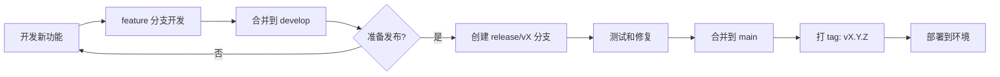

# 微服务 API 文档管理技术方案

## 一、方案概述

### 1.1 背景与挑战

**项目现状**
- 服务数量：10个微服务，预计增长至20+
- 部署模式：公有云 SaaS + 多个私有云部署
- 版本管理：每个服务多版本并存，不同客户部署不同版本
- 文档需求：需要为不同环境提供独立、准确的 API 文档

**核心挑战**
1. 多版本管理：同一服务的多个 API 版本需要共存并维护独立文档
2. 多环境隔离：公有云和私有云部署版本不同，需要环境级文档隔离
3. 自动化需求：文档需与代码自动同步，减少人工维护成本
4. 扩展性要求：支持服务数量持续增长

### 1.2 解决方案

采用**三层文档管理架构** + **Git 分支版本管理**策略：

```
┌─────────────────────────────────────────────────────────────┐
│                    三层文档管理架构                            │
├─────────────────────────────────────────────────────────────┤
│                                                               │
│  Layer 1: 服务层                                              │
│  - 每个微服务通过 Git 分支管理不同版本                          │
│  - 使用 Swaggo 自动生成 Swagger 文档                          │
│  - 通过 baseURL 配置控制 API 版本前缀                          │
│                                                               │
│  Layer 2: 聚合层                                              │
│  - 环境级文档聚合服务（公有云/私有云独立部署）                   │
│  - 自动从各微服务拉取并聚合文档                                 │
│  - 提供统一的 Swagger UI 入口                                 │
│                                                               │
│  Layer 3: 管理层（可选）                                       │
│  - 全局文档门户，管理多环境入口                                 │
│  - 版本生命周期可视化                                          │
│                                                               │
└─────────────────────────────────────────────────────────────┘
```

---

## 二、技术架构设计

### 2.1 服务层：Git 分支版本管理

#### 分支策略

```
main (最新稳定版本)
├── release/v3 → 部署到公有云（Docker）
├── release/v2 → 部署到部分客户私有云（Docker）
└── release/v1 → 部署到老客户私有云（Docker，维护模式）
```

#### 部署模式说明

| 环境 | 部署方式 | 文档访问方式 | 说明 |
|------|---------|-------------|------|
| **本地开发** | 直接运行 Go | `localhost:8001/swagger/` | 开发者本机，快速迭代 |
| **远程开发** | Docker Compose | `dev-docs:9000/docs/xxx` | 团队共享开发环境 |
| **测试环境** | Docker + K8s | `test-docs:9000/docs/xxx` | 自动化测试环境 |
| **生产环境** | Docker + K8s | `api-docs.company.com` | 生产部署 |

#### 目录结构

```
user-service/
├── cmd/
│   └── main.go              # 应用入口
├── internal/
│   ├── handler/
│   │   └── user.go          # 业务处理器（包名不变）
│   ├── model/
│   │   └── user.go          # 数据模型
│   └── router/
│       └── router.go        # 路由配置
├── docs/
│   └── swagger/             # Swagger 生成目录（不提交 docs.go）
│       ├── swagger.json         # 提交到仓库
│       └── swagger.yaml         # 提交到仓库
├── configs/
│   ├── config.local.yaml    # 本地开发配置
│   ├── config.dev.yaml      # 远程开发环境配置
│   ├── config.test.yaml     # 测试环境配置
│   ├── config.prod.yaml     # 公有云生产配置
│   └── config.private.yaml  # 私有云配置模板
├── deployments/
│   ├── docker-compose.yml          # 本地/开发环境
│   ├── docker-compose.dev.yml      # 远程开发环境
│   ├── docker-compose.test.yml     # 测试环境
│   └── kubernetes/                 # 生产环境 K8s 配置
│       ├── deployment.yaml
│       ├── service.yaml
│       └── configmap.yaml
├── .gitignore
├── .swagger-version         # 当前版本标识
├── Dockerfile               # 多阶段构建
├── Dockerfile.dev           # 开发环境专用（含热重载）
├── Makefile
├── go.mod
└── README.md
```

#### 配置文件控制 API 版本

```yaml
# configs/config.local.yaml (本地开发)
server:
  port: 8001
  base_path: "/api/v3"
  environment: "local"

swagger:
  enabled: true
  title: "User Service API"
  version: "3.0.0"
  description: "用户管理服务 v3 - 本地开发环境"
  host: "localhost:8001"
  schemes: ["http"]

database:
  host: "localhost"         # 本地直连数据库
  port: 5432
  name: "users_dev"

redis:
  host: "localhost"         # 本地直连 Redis
  port: 6379
```

```yaml
# configs/config.dev.yaml (远程开发环境 - Docker)
server:
  port: 8001
  base_path: "/api/v3"
  environment: "development"

swagger:
  enabled: true
  title: "User Service API"
  version: "3.0.0"
  description: "用户管理服务 v3 - 开发环境"
  host: "dev.api.company.com"
  schemes: ["https"]

database:
  host: "postgres"          # Docker Compose 服务名
  port: 5432
  name: "users"

redis:
  host: "redis"             # Docker Compose 服务名
  port: 6379
```

```yaml
# configs/config.prod.yaml (生产环境 - K8s)
server:
  port: 8001
  base_path: "/api/v3"
  environment: "production"

swagger:
  enabled: false           # 生产环境可选择关闭或限制访问
  title: "User Service API"
  version: "3.0.0"
  description: "用户管理服务 v3"
  host: "api.company.com"
  schemes: ["https"]

database:
  host: "postgres.internal.svc.cluster.local"  # K8s 内部 DNS
  port: 5432
  name: "users"

redis:
  host: "redis.internal.svc.cluster.local"     # K8s 内部 DNS
  port: 6379
```

### 2.2 聚合层：环境级文档服务

#### 架构图

```
┌──────────────────────────────────────────────────────────────────┐
│                     部署架构（分层）                               │
├──────────────────────────────────────────────────────────────────┤
│                                                                    │
│  【本地开发】Go 直接运行                                            │
│  Developer Mac/PC                                                 │
│  ├─ user-service (localhost:8001)  ← 直接访问文档                │
│  ├─ order-service (localhost:8002)                               │
│  └─ product-service (localhost:8003)                             │
│                                                                    │
│  【远程开发】Docker Compose                                         │
│  Development Server                                               │
│  ├─ user-service:v3 (container)                                  │
│  ├─ order-service:v3 (container)                                 │
│  ├─ docs-aggregator (container) ← 统一文档入口                    │
│  └─ postgres, redis (containers)                                 │
│       ↓                                                            │
│    访问: http://dev-docs.internal:9000                            │
│                                                                    │
│  【测试环境】Docker + Kubernetes                                    │
│  Test Cluster                                                     │
│  ├─ user-service:v3 (pods)                                       │
│  ├─ order-service:v3 (pods)                                      │
│  ├─ docs-aggregator (pods) ← 统一文档入口                         │
│  └─ postgres, redis (managed services)                           │
│       ↓                                                            │
│    访问: https://test-docs.company.com                            │
│                                                                    │
│  【生产环境】Kubernetes                                             │
│  ┌─────────────┐     ┌──────────────┐     ┌──────────────┐      │
│  │ 公有云       │     │ 私有云客户A   │     │ 私有云客户B   │      │
│  │ (K8s)       │     │ (K8s)        │     │ (K8s)        │      │
│  ├──────────────┤     ├──────────────┤     ├──────────────┤      │
│  │ Services v3 │     │ Services v2  │     │ Services v3  │      │
│  │ Docs Agg    │     │ Docs Agg     │     │ Docs Agg     │      │
│  └──────────────┘     └──────────────┘     └──────────────┘      │
│         ↓                   ↓                     ↓               │
│   api-docs.com    customer-a-docs.com   customer-b-docs.com     │
│                                                                    │
└──────────────────────────────────────────────────────────────────┘
```

#### Docker 部署配置

#### Docker 部署配置

**1. 本地/远程开发环境 Docker Compose**

```yaml
# docker-compose.dev.yml
version: '3.8'

services:
  # ============ 微服务 ============
  user-service:
    build:
      context: ./services/user-service
      dockerfile: Dockerfile.dev  # 开发环境专用，支持热重载
    container_name: user-service-dev
    environment:
      - CONFIG_FILE=/app/configs/config.dev.yaml
      - GIN_MODE=debug
    volumes:
      - ./services/user-service:/app  # 挂载代码，支持热重载
    ports:
      - "8001:8001"
    depends_on:
      - postgres
      - redis
    networks:
      - microservices
    healthcheck:
      test: ["CMD", "curl", "-f", "http://localhost:8001/health"]
      interval: 30s
      timeout: 10s
      retries: 3

  order-service:
    build:
      context: ./services/order-service
      dockerfile: Dockerfile.dev
    container_name: order-service-dev
    environment:
      - CONFIG_FILE=/app/configs/config.dev.yaml
    volumes:
      - ./services/order-service:/app
    ports:
      - "8002:8002"
    depends_on:
      - postgres
      - redis
    networks:
      - microservices

  product-service:
    build:
      context: ./services/product-service
      dockerfile: Dockerfile.dev
    container_name: product-service-dev
    environment:
      - CONFIG_FILE=/app/configs/config.dev.yaml
    volumes:
      - ./services/product-service:/app
    ports:
      - "8003:8003"
    depends_on:
      - postgres
      - redis
    networks:
      - microservices

  # ============ 文档聚合服务 ============
  docs-aggregator:
    build: ./docs-aggregator
    container_name: docs-aggregator-dev
    environment:
      - CONFIG_PATH=/config/dev.yaml
      - PORT=9000
      - ENVIRONMENT=development
    volumes:
      - ./docs-aggregator/configs:/config
      - ./docs-aggregator/web:/app/web  # 挂载前端资源
    ports:
      - "9000:9000"
    depends_on:
      - user-service
      - order-service
      - product-service
    networks:
      - microservices
    labels:
      - "description=API Documentation Aggregator"

  # ============ 基础设施 ============
  postgres:
    image: postgres:14-alpine
    container_name: postgres-dev
    environment:
      - POSTGRES_USER=postgres
      - POSTGRES_PASSWORD=postgres
      - POSTGRES_DB=microservices
    volumes:
      - postgres_data:/var/lib/postgresql/data
      - ./scripts/init-db.sql:/docker-entrypoint-initdb.d/init.sql
    ports:
      - "5432:5432"
    networks:
      - microservices

  redis:
    image: redis:7-alpine
    container_name: redis-dev
    ports:
      - "6379:6379"
    networks:
      - microservices

  # ============ 可选：Nginx 反向代理 ============
  nginx:
    image: nginx:alpine
    container_name: nginx-dev
    volumes:
      - ./deployments/nginx/nginx.dev.conf:/etc/nginx/nginx.conf:ro
    ports:
      - "8080:8080"  # 统一入口
    depends_on:
      - docs-aggregator
      - user-service
      - order-service
      - product-service
    networks:
      - microservices

volumes:
  postgres_data:

networks:
  microservices:
    driver: bridge
```

**2. 测试环境 Docker Compose**

```yaml
# docker-compose.test.yml
version: '3.8'

services:
  user-service:
    image: ${REGISTRY}/user-service:${VERSION:-latest}
    container_name: user-service-test
    environment:
      - CONFIG_FILE=/app/configs/config.test.yaml
      - GIN_MODE=release
    ports:
      - "8001:8001"
    networks:
      - microservices
    restart: unless-stopped

  # ... 其他服务类似 ...

  docs-aggregator:
    image: ${REGISTRY}/docs-aggregator:${VERSION:-latest}
    container_name: docs-aggregator-test
    environment:
      - CONFIG_PATH=/config/test.yaml
      - PORT=9000
    volumes:
      - ./docs-aggregator/configs:/config:ro
    ports:
      - "9000:9000"
    networks:
      - microservices
    restart: unless-stopped

networks:
  microservices:
    driver: bridge
```

**3. 生产环境 Kubernetes 配置**

```yaml
# deployments/kubernetes/user-service-deployment.yaml
apiVersion: apps/v1
kind: Deployment
metadata:
  name: user-service
  namespace: production
  labels:
    app: user-service
    version: v3
spec:
  replicas: 3
  selector:
    matchLabels:
      app: user-service
  template:
    metadata:
      labels:
        app: user-service
        version: v3
    spec:
      containers:
      - name: user-service
        image: ghcr.io/company/user-service:v3.2.1
        imagePullPolicy: Always
        ports:
        - containerPort: 8001
          name: http
        env:
        - name: CONFIG_FILE
          value: /config/config.prod.yaml
        - name: GIN_MODE
          value: release
        volumeMounts:
        - name: config
          mountPath: /config
          readOnly: true
        livenessProbe:
          httpGet:
            path: /health
            port: 8001
          initialDelaySeconds: 30
          periodSeconds: 10
        readinessProbe:
          httpGet:
            path: /health
            port: 8001
          initialDelaySeconds: 5
          periodSeconds: 5
        resources:
          requests:
            memory: "128Mi"
            cpu: "100m"
          limits:
            memory: "512Mi"
            cpu: "500m"
      volumes:
      - name: config
        configMap:
          name: user-service-config

---
apiVersion: v1
kind: Service
metadata:
  name: user-service
  namespace: production
spec:
  selector:
    app: user-service
  ports:
  - port: 8001
    targetPort: 8001
    name: http
  type: ClusterIP

---
apiVersion: v1
kind: ConfigMap
metadata:
  name: user-service-config
  namespace: production
data:
  config.prod.yaml: |
    server:
      port: 8001
      base_path: "/api/v3"
      environment: "production"
    swagger:
      enabled: false
      title: "User Service API"
      version: "3.0.0"
    database:
      host: "postgres.internal.svc.cluster.local"
      port: 5432
      name: "users"
    redis:
      host: "redis.internal.svc.cluster.local"
      port: 6379
```

```yaml
# deployments/kubernetes/docs-aggregator-deployment.yaml
apiVersion: apps/v1
kind: Deployment
metadata:
  name: docs-aggregator
  namespace: production
spec:
  replicas: 2
  selector:
    matchLabels:
      app: docs-aggregator
  template:
    metadata:
      labels:
        app: docs-aggregator
    spec:
      containers:
      - name: docs-aggregator
        image: ghcr.io/company/docs-aggregator:latest
        ports:
        - containerPort: 9000
        env:
        - name: CONFIG_PATH
          value: /config/prod.yaml
        - name: ENVIRONMENT
          value: production
        volumeMounts:
        - name: config
          mountPath: /config
        resources:
          requests:
            memory: "64Mi"
            cpu: "50m"
          limits:
            memory: "256Mi"
            cpu: "200m"
      volumes:
      - name: config
        configMap:
          name: docs-aggregator-config

---
apiVersion: v1
kind: Service
metadata:
  name: docs-aggregator
  namespace: production
spec:
  selector:
    app: docs-aggregator
  ports:
  - port: 9000
    targetPort: 9000
  type: ClusterIP

---
apiVersion: networking.k8s.io/v1
kind: Ingress
metadata:
  name: docs-aggregator-ingress
  namespace: production
  annotations:
    cert-manager.io/cluster-issuer: letsencrypt-prod
    nginx.ingress.kubernetes.io/ssl-redirect: "true"
spec:
  ingressClassName: nginx
  tls:
  - hosts:
    - api-docs.company.com
    secretName: docs-tls
  rules:
  - host: api-docs.company.com
    http:
      paths:
      - path: /
        pathType: Prefix
        backend:
          service:
            name: docs-aggregator
            port:
              number: 9000
```

### 2.3 技术栈选型

| 层级 | 技术选型 | 说明 |
|------|---------|------|
| **服务层** | Go + Gin + Swaggo | 业务服务框架 + 文档生成 |
| **聚合层** | Go + Gin + Swagger UI | 文档聚合服务 |
| **部署** | Docker + Kubernetes | 容器化部署 |
| **CI/CD** | GitHub Actions | 自动化构建和部署 |
| **版本管理** | Git 分支策略 | 代码和文档版本控制 |
| **配置管理** | YAML | 环境和版本配置 |

---

## 三、实施方案

### 3.1 Phase 1: 服务层改造（1-2周）

**目标**：改造现有微服务支持多环境部署和版本化配置

**任务清单**
- [ ] 为每个服务创建版本分支（v1, v2, v3）
- [ ] 添加 Swaggo 注解到所有 API 接口
- [ ] 创建多环境配置文件（local, dev, test, prod）
- [ ] 编写生产环境 Dockerfile（多阶段构建）
- [ ] 编写开发环境 Dockerfile.dev（支持热重载）
- [ ] 配置 docker-compose.dev.yml 和 docker-compose.test.yml
- [ ] 编写 Makefile 自动化命令
- [ ] 配置 .gitignore（忽略 docs.go，保留 swagger.json/yaml）
- [ ] 更新 README 添加 Docker 运行说明
- [ ] 本地测试：直接运行 + Docker 运行

**交付物**
- ✅ 每个服务支持通过配置切换环境和 API 版本
- ✅ 支持本地直接运行和 Docker 容器运行
- ✅ 自动生成的 Swagger 文档
- ✅ 标准化的 Docker 部署配置

**本地验证步骤**
```bash
# 1. 本地直接运行
cd services/user-service
make docs
make run-local  # 使用 config.local.yaml
open http://localhost:8001/swagger/index.html

# 2. Docker 运行验证
cd project-root
docker-compose -f docker-compose.dev.yml up -d
open http://localhost:9000  # 访问文档聚合服务
```

### 3.2 Phase 2: 聚合服务开发（1周）

**目标**：开发文档聚合服务并支持 Docker 部署

**任务清单**
- [ ] 开发文档聚合服务核心功能
- [ ] 实现配置文件驱动的服务发现
- [ ] 实现文档缓存和定期刷新机制
- [ ] 开发统一 Swagger UI 界面
- [ ] 添加健康检查和监控指标
- [ ] 编写 Dockerfile 和 docker-compose.yml
- [ ] 创建多环境配置（dev, test, prod）
- [ ] 编写部署文档和运维手册
- [ ] 测试 Docker 环境下的服务发现和文档聚合

**交付物**
- ✅ 独立的文档聚合服务（支持 Docker 部署）
- ✅ 多环境配置模板（dev.yaml, test.yaml, prod.yaml）
- ✅ Docker 镜像和 docker-compose 配置
- ✅ Kubernetes 部署清单（可选）
- ✅ 部署和运维文档

**验证步骤**
```bash
# 1. 本地开发环境测试
docker-compose -f docker-compose.dev.yml up -d
curl http://localhost:9000/api/catalog
open http://localhost:9000

# 2. 测试服务发现
docker-compose -f docker-compose.dev.yml ps
docker-compose -f docker-compose.dev.yml logs docs-aggregator

# 3. 测试文档聚合
curl http://localhost:9000/api/docs/user-service/swagger.json
```

### 3.3 Phase 3: CI/CD 配置（3-5天）

**目标**：自动化构建、测试、部署流程（Docker + K8s）

**任务清单**
- [ ] 配置 GitHub Actions 多阶段工作流
  - [ ] 代码检查和单元测试
  - [ ] 自动生成 Swagger 文档
  - [ ] 构建 Docker 镜像（多架构支持）
  - [ ] 推送镜像到容器仓库（GHCR/Docker Hub）
  - [ ] 部署到远程开发环境
  - [ ] 部署到测试环境
  - [ ] 生产环境部署审批流程
- [ ] 配置文档验证检查（swagger-cli）
- [ ] 配置镜像扫描（Trivy）
- [ ] 配置多环境部署策略
- [ ] 添加部署回滚机制
- [ ] 编写 CI/CD 运维文档

**交付物**
- ✅ GitHub Actions 工作流配置
- ✅ Docker 镜像自动构建和推送
- ✅ 多环境自动部署脚本
- ✅ CI/CD 运维文档
- ✅ 部署状态监控大盘

**GitHub Actions 工作流示例**
```yaml
# .github/workflows/deploy.yml
name: Build and Deploy

on:
  push:
    branches: [ main, release/* ]
  pull_request:
    branches: [ main ]

env:
  REGISTRY: ghcr.io
  IMAGE_NAME: ${{ github.repository }}

jobs:
  # 检查和测试
  test:
    runs-on: ubuntu-latest
    steps:
      - uses: actions/checkout@v3

      - name: Setup Go
        uses: actions/setup-go@v4
        with:
          go-version: '1.21'

      - name: Install dependencies
        run: go mod download

      - name: Run tests
        run: make test

      - name: Generate docs
        run: |
          go install github.com/swaggo/swag/cmd/swag@latest
          make docs

      - name: Validate Swagger
        run: |
          npm install -g @apidevtools/swagger-cli
          swagger-cli validate docs/swagger.json

  # 构建 Docker 镜像
  build:
    needs: test
    runs-on: ubuntu-latest
    strategy:
      matrix:
        service: [user-service, order-service, product-service]
    steps:
      - uses: actions/checkout@v3

      - name: Set up Docker Buildx
        uses: docker/setup-buildx-action@v2

      - name: Log in to Container Registry
        uses: docker/login-action@v2
        with:
          registry: ${{ env.REGISTRY }}
          username: ${{ github.actor }}
          password: ${{ secrets.GITHUB_TOKEN }}

      - name: Extract metadata
        id: meta
        uses: docker/metadata-action@v4
        with:
          images: ${{ env.REGISTRY }}/${{ env.IMAGE_NAME }}/${{ matrix.service }}
          tags: |
            type=ref,event=branch
            type=ref,event=pr
            type=semver,pattern={{version}}
            type=sha

      - name: Build and push
        uses: docker/build-push-action@v4
        with:
          context: ./services/${{ matrix.service }}
          push: true
          tags: ${{ steps.meta.outputs.tags }}
          labels: ${{ steps.meta.outputs.labels }}
          cache-from: type=registry,ref=${{ env.REGISTRY }}/${{ env.IMAGE_NAME }}/${{ matrix.service }}:buildcache
          cache-to: type=registry,ref=${{ env.REGISTRY }}/${{ env.IMAGE_NAME }}/${{ matrix.service }}:buildcache,mode=max

  # 部署到开发环境
  deploy-dev:
    needs: build
    if: github.ref == 'refs/heads/main'
    runs-on: ubuntu-latest
    environment: development
    steps:
      - uses: actions/checkout@v3

      - name: Deploy to Dev
        run: |
          # SSH 到开发服务器并部署
          # 或者使用 kubectl 部署到 K8s
          echo "Deploying to development environment"

  # 部署到测试环境
  deploy-test:
    needs: build
    if: github.ref == 'refs/heads/main'
    runs-on: ubuntu-latest
    environment: testing
    steps:
      - uses: actions/checkout@v3

      - name: Deploy to Test
        run: |
          # 部署到测试环境
          echo "Deploying to test environment"

  # 部署到生产环境（需要审批）
  deploy-prod:
    needs: build
    if: startsWith(github.ref, 'refs/heads/release/')
    runs-on: ubuntu-latest
    environment: production
    steps:
      - uses: actions/checkout@v3

      - name: Deploy to Production
        run: |
          # 部署到生产环境
          echo "Deploying to production environment"
```

### 3.4 Phase 4: 环境部署（1周）

**目标**：部署到各个环境（Docker + K8s）

**任务清单**
- [ ] 搭建远程开发环境
  - [ ] 部署 Docker Compose 环境
  - [ ] 配置持续部署（main 分支自动部署）
  - [ ] 配置开发环境域名和 SSL
- [ ] 搭建测试环境
  - [ ] 部署 Kubernetes 集群（或使用现有集群）
  - [ ] 部署所有微服务和文档聚合服务
  - [ ] 配置 Ingress 和 SSL 证书
  - [ ] 配置自动化测试流水线
- [ ] 部署公有云生产环境
  - [ ] 部署 Kubernetes 集群
  - [ ] 配置高可用和自动扩缩容
  - [ ] 配置生产域名和 SSL
  - [ ] 配置监控和告警
- [ ] 为现有私有云客户部署独立实例
  - [ ] 为每个客户创建独立的配置
  - [ ] 部署独立的文档聚合服务
  - [ ] 配置客户专属域名
- [ ] 配置统一的监控和告警系统
- [ ] 编写用户使用指南和运维手册

**交付物**
- ✅ 各环境可访问的文档门户
  - 开发: http://dev-docs.internal:9000
  - 测试: https://test-docs.company.com
  - 生产: https://api-docs.company.com
- ✅ 监控大盘和告警规则
- ✅ 用户操作手册
- ✅ 运维文档和故障处理手册

**部署验证清单**
```bash
# 远程开发环境
ssh dev-server
docker-compose -f docker-compose.dev.yml ps
curl http://dev-docs.internal:9000/health

# 测试环境（K8s）
kubectl get pods -n test
kubectl get ingress -n test
curl https://test-docs.company.com/health

# 生产环境（K8s）
kubectl get pods -n production
kubectl get ingress -n production
curl https://api-docs.company.com/health

# 私有云客户A
ssh customer-a-server
kubectl get pods -n customer-a
curl https://customer-a-docs.company.com/health
```

---

## 四、版本管理规范

### 4.1 Git 分支策略

```
main                    # 最新开发版本
├── develop             # 开发分支
├── release/v3          # v3 稳定版（公有云）
├── release/v2          # v2 稳定版（部分私有云）
└── release/v1          # v1 维护版（老客户）
```

**分支规则**
- `main`: 最新稳定代码，保护分支
- `release/vX`: 对应版本的稳定分支，只接受 bugfix
- `feature/*`: 功能分支，合并到 develop
- `hotfix/*`: 紧急修复，可直接合并到 release 分支

### 4.2 版本发布流程



### 4.3 版本号规范

遵循**语义化版本** (Semantic Versioning 2.0.0)

```
vMAJOR.MINOR.PATCH

v3.2.1
│ │ │
│ │ └─ PATCH: 向后兼容的 bug 修复
│ └─── MINOR: 向后兼容的新功能
└───── MAJOR: 不兼容的 API 变更
```

**示例**
- `v1.0.0` → `v1.1.0`: 新增功能，兼容 v1
- `v1.1.0` → `v1.1.1`: Bug 修复
- `v1.x.x` → `v2.0.0`: 破坏性变更，不兼容 v1

### 4.4 版本生命周期

| 状态 | 说明 | 支持期限 |
|------|------|---------|
| **Current** | 最新稳定版本，推荐使用 | 持续支持 |
| **Stable** | 稳定支持版本 | 12-18个月 |
| **Deprecated** | 已废弃，建议迁移 | 6个月 |
| **EOL** | 生命周期结束，不再支持 | - |

---

## 五、开发工作流

### 5.1 日常开发流程

**场景 1：本地开发（直接运行）**

```bash
1. 切换到对应版本分支
   git checkout release/v3

2. 创建功能分支
   git checkout -b feature/add-user-export

3. 开发并添加 Swagger 注解
   vim internal/handler/user.go

4. 本地生成文档并测试
   make docs
   make run-local
   open http://localhost:8001/swagger/index.html

5. 运行单元测试
   make test

6. 提交代码
   git add .
   git commit -m "feat: add user export API"
   git push origin feature/add-user-export

7. 创建 Pull Request
   目标分支: release/v3

8. Code Review 和测试通过后合并

9. 自动触发 CI/CD
   - 自动生成文档
   - 构建 Docker 镜像
   - 部署到远程开发环境
   - 部署到测试环境
```

**场景 2：使用 Docker 开发（热重载）**

```bash
1. 启动开发环境
   docker-compose -f docker-compose.dev.yml up -d

   # 查看日志
   docker-compose -f docker-compose.dev.yml logs -f user-service

2. 代码修改自动重新加载
   # 修改代码后，容器会自动重新编译和启动
   vim services/user-service/internal/handler/user.go
   # 观察日志中的重启信息

3. 访问文档
   open http://localhost:9000
   # 选择 user-service 查看文档

4. 测试 API
   curl http://localhost:8001/api/v3/users

5. 停止环境
   docker-compose -f docker-compose.dev.yml down
```

**场景 3：远程开发环境测试**

```bash
1. 推送代码到 main 分支
   git push origin main

2. GitHub Actions 自动部署到远程开发环境

3. 访问远程开发环境文档
   open https://dev-docs.internal.company.com

4. 在远程环境测试 API
   curl https://dev-api.internal.company.com/api/v3/users
```

### 5.2 版本升级流程

**场景：客户从 v2 升级到 v3**

```
1. 评估变更影响
   - 查看 CHANGELOG.md
   - 对比 API 差异

2. 部署 v3 服务到测试环境
   kubectl apply -f k8s/user-service-v3.yaml

3. 配置文档聚合服务同时支持 v2 和 v3
   编辑 configs/private-cloud-customer-A.yaml:
   services:
     - name: user-service
       versions: ["v2", "v3"]  # 同时暴露两个版本

4. 客户端逐步迁移
   - 灰度切换流量
   - 监控错误率

5. v2 下线
   - 移除 v2 配置
   - 更新文档
```

### 5.3 紧急修复流程

```
1. 从 release 分支创建 hotfix
   git checkout release/v2
   git checkout -b hotfix/fix-critical-bug

2. 修复并测试
   vim internal/handler/user.go
   make test

3. 提交并合并
   git commit -m "fix: critical security issue"
   git push origin hotfix/fix-critical-bug
   # 合并到 release/v2

4. 打补丁版本 tag
   git tag v2.3.1
   git push origin v2.3.1

5. 自动部署到受影响的环境
   CI/CD 自动识别 tag 并部署
```

---

## 六、配置管理

### 6.1 服务配置示例

```yaml
# configs/public-cloud.yaml
server:
  port: 8001
  base_path: "/api/v3"
  environment: "production"

swagger:
  enabled: true
  title: "User Service API"
  version: "3.0.0"
  description: "用户管理服务"
  host: "api.company.com"
  schemes: ["https"]

database:
  host: "postgres.internal"
  port: 5432
  name: "users"

redis:
  host: "redis.internal"
  port: 6379
```

### 6.2 文档聚合配置示例

```yaml
# docs-aggregator/configs/public-cloud.yaml
environment: "public-cloud"
tenant: "saas"
region: "global"
refresh_interval: "5m"

services:
  - name: "user-service"
    display_name: "用户服务"
    base_url: "http://user-service:8001"
    doc_path: "/docs/swagger.json"
    health_check: "/health"
    status: "active"
    owner: "user-team@company.com"
    description: "用户账户管理服务"
    tags: ["core", "authentication"]

  - name: "order-service"
    display_name: "订单服务"
    base_url: "http://order-service:8002"
    doc_path: "/docs/swagger.json"
    health_check: "/health"
    status: "active"
    owner: "order-team@company.com"
    description: "订单处理服务"
    tags: ["business", "transaction"]
```

---

## 七、监控与运维

### 7.1 监控指标

**服务层监控**
- API 响应时间
- 错误率（按版本区分）
- 请求量（按版本区分）

**文档聚合服务监控**
- 文档刷新成功率
- 文档刷新耗时
- 缓存命中率
- 服务可用性

### 7.2 告警规则

```yaml
# 文档刷新失败告警
- alert: DocsRefreshFailure
  expr: docs_refresh_errors_total > 0
  for: 5m
  labels:
    severity: warning
  annotations:
    summary: "文档刷新失败"
    description: "{{ $labels.service }} 文档刷新失败"

# 服务不可用告警
- alert: ServiceDown
  expr: up{job="docs-aggregator"} == 0
  for: 1m
  labels:
    severity: critical
  annotations:
    summary: "文档聚合服务宕机"
```

---

## 八、优势与价值

### 8.1 技术优势

1. **版本管理清晰**：Git 分支天然支持版本隔离，包名不变降低维护成本
2. **环境独立**：每个环境独立部署文档服务，避免混淆
3. **自动化程度高**：CI/CD 自动生成、部署，减少人工介入
4. **扩展性强**：支持 20+ 服务，轻松添加新服务
5. **配置驱动**：通过配置文件控制版本和环境，灵活适配

### 8.2 业务价值

1. **降低沟通成本**：开发、测试、客户都能查看准确的 API 文档
2. **提升开发效率**：文档与代码同步，减少文档过期问题
3. **支持多租户**：私有云客户查看独立文档，避免信息泄露
4. **版本透明**：清晰的版本状态和生命周期管理
5. **降低运维成本**：自动化程度高，减少人工维护

---

## 九、风险与应对

### 9.1 潜在风险

| 风险 | 影响 | 应对措施 |
|------|------|---------|
| 分支管理复杂 | 中 | 制定清晰的分支策略和合并规范 |
| 文档延迟更新 | 低 | 设置合理的刷新间隔（5分钟） |
| 多版本维护成本 | 中 | 明确版本生命周期，及时淘汰老版本 |
| 网络隔离导致文档不可用 | 低 | 私有云内部部署聚合服务 |

### 9.2 回退方案

- 服务层：保留原有 API，新版本并行部署
- 聚合层：故障时可降级到直接访问各服务文档
- 数据层：文档缓存，网络故障时使用缓存数据

---

## 十、附录

### 10.1 参考资料

- [Swaggo 官方文档](https://github.com/swaggo/swag)
- [Swagger UI 文档](https://swagger.io/tools/swagger-ui/)
- [语义化版本规范](https://semver.org/lang/zh-CN/)
- [Git 分支管理策略](https://git-scm.com/book/zh/v2)

### 10.2 相关工具

- Swag CLI: `go install github.com/swaggo/swag/cmd/swag@latest`
- Swagger Editor: https://editor.swagger.io/
- API 测试工具: Postman, Insomnia

### 10.3 团队分工建议

| 角色 | 职责 |
|------|------|
| **架构师** | 方案设计、技术选型 |
| **后端开发** | 服务改造、聚合服务开发 |
| **DevOps** | CI/CD 配置、环境部署 |
| **测试** | 文档准确性验证、自动化测试 |
| **技术写作** | README、用户手册编写 |